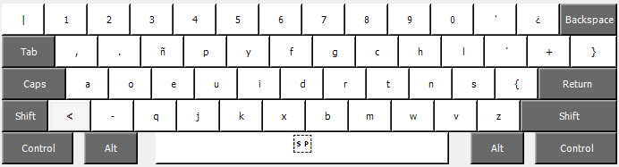

# Latam-Dvorak(qwerty-ctrl)

Esta es una distribución de teclado dvorak en español latinoamérica 

# Instalación

Copias los archivos como un zip en tu computadora y ejecutas el **setup.exe**, luego de realizar eso tenés que reiniciar tu computadora y tu distribución de teclado ya te debería aparecer en configuración->Hora e idioma->Idioma-español lationamerica
